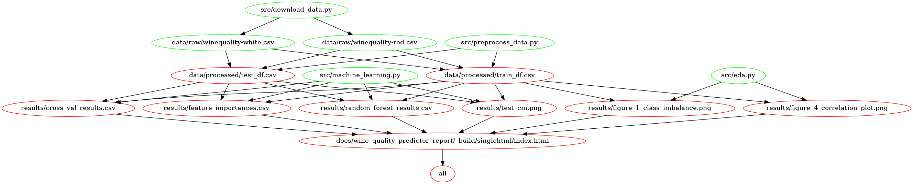

# Wine Quality Predictor

- authors: Gabriel Fairbrother, Paniz Fazlali, Luming Yang, Wanying Ye; The University of British Columbia, Master of Data Science.

A data analysis (machine learning) project for MDS DSCI522 (Data Science Workflows) from Group 09.

## About
In this project, we attempt to answer the question: Can we use a machine learning model to predict the human perceived quality of a wine using its physical and chemical attributes? Moreover which of these attribute contributes most to that perceived quality? We compared results from 3 different machine learning models (SVC with Linear Kernel, Logistic Regression, and Random Forest) and selected the best performer (Random Forest). With Random Forest we achieved an ROC/AUC test score of 0.685. Further, we found that Alcohol, Density and Volatile Acidity were the top contributors to higher quality scores. These are promising results and have application in the industry. Though the selected model performed reasonably well, a significant gap between our cross-validation and test set results means there is room for improvement.


The data sets were sampled from the red and white _vinho verde_ wines from the North of Portugal, created by P. Cortez, A. Cerdeira, F. Almeida, T. Matos and J. Reis (2009). The data sets were sourced from the UC Irvine Machine Learning Repository and can be found [here](https://archive-beta.ics.uci.edu/ml/datasets/wine+quality). One data set is for the red wine, and the other is for the white wine, and both data sets have the same features and target columns. Each row represents a wine sample with its physicochemical properties such as fixed acidity, volatile acidity, etc. The target is a score (integer) ranging from 3 (very bad) to 9 (excellent) that represents the quality of the wine. 

## Report

[The final report can be found here](https://ubc-mds.github.io/DSCI_522_group09_Wine_Quality_Predictor/index.html).

## Usage
There are two suggested ways to run this analysis. The computation time is about 15 mins.

**1. Using Docker**  
To replicate the analysis, install Docker. Then clone this GitHub repository and run the following command at the command line/terminal from the root directory of this project:
```python
docker-compose run --rm analysis-env make all
```
To reset the repo to a clean state, with no intermediate or results files, run the following command at the command line/terminal from the root directory of this project:
```python
docker-compose run --rm analysis-env make clean
```

**2. Without using Docker**  
To replicate the analysis, clone this GitHub repository, install the [dependencies](#dependencies) listed below, and run the following commands at the command line/terminal from the root directory of this project:

```python
make all
```
This command will download and preprocess the data. Then, it will create exploratory data analysis and run the machine learning analysis. Finally, it will create a report replicating all we have done in the project.

If you want to remove the files created during running the above command, run the command below from the root directory of this project:

```python
make clean
```

## Dependencies

To set up the conda environment necessary to reproduce the data analysis, navigate to the root of this project, and then run the following commands at the command line/terminal from the root directory of this project:

```python
conda env create --file src/environment.yml
conda activate wine_quality_predictor
```

For Windows users, this additional command needs to be run:
```python
npm install -g vega vega-cli vega-lite canvas
```

Python 3.10.0 and Python packages: 
- ipykernel==6.5.0
- pandas==1.3.4
- scikit-learn==1.0.1
- vega_datasets==0.9.0
- matplotlib==3.5.0
- altair==4.1.0
- altair_viewer==0.4.0
- altair_saver==0.5.0
- jupyter-book==0.12.1
- docopt==0.6.2

GNU Make 3.81

Dependency diagram of the Makefile is showing below:


## References

[References can be found here](https://ubc-mds.github.io/DSCI_522_group09_Wine_Quality_Predictor/index.html#document-bibliography).
